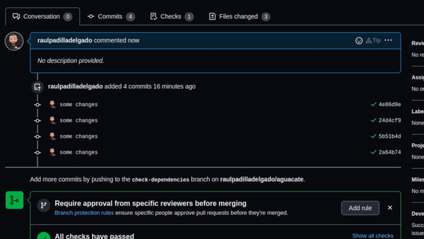

# Check Dependencies in Pull Request Action

This GitHub Action was born for that person or team that prefer to handle manually it's gradle dependencies. It publishes 
a comment in your PR when it's necessary to update gradle dependencies

 

## Requirements 

You must have in your project the [Ben Manes - Gradle Versions Plugin](https://github.com/ben-manes/gradle-versions-plugin#gradle-versions-plugin)

## Inputs

## `pull_request_url`

The pull request URL to publish the result

## `github_token`

The project's GitHub token for posting the comment.

## Example usage

```yaml
name: Check Dependencies

on:
  pull_request:
    types: [opened]
jobs:
  dependency_check:
    runs-on: ubuntu-latest
    name: Check dependencies and add a comment in the PR with the result
    steps:
      - name: Checkout project sources
        uses: actions/checkout@v2
      - name: Check Dependencies
        uses: raulpadilladelgado/check-dependencies-in-pr-action@1.0.1
        with:
          pull_request_url: ${{ github.event.pull_request.comments_url }}
          github_token: ${{ secrets.GITHUB_TOKEN }}
```

I recommend keeping "opened" pull request type, to avoid a lot of messages in your pull request about Gradle dependencies
Updates, with this approach the message only appears one time.

